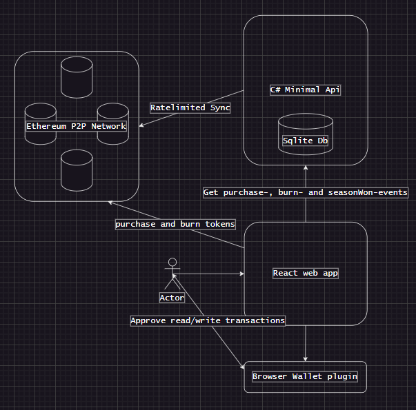

# SubredditBattleRoyale

SubredditBattleRoyale is a battle royale token for subreddits to flex on each other, or for people to secure the void will win against subreddits. When a winner is found, a new and harder season is started.

## Game summary
* Start with 1_000_000 tokens. They cost 0.0001 ether to purchase. 
* Tokens should be inscribed with a subreddit. It should always start with "/r/" followed by no less than one character.
* A "season" is won, when a subreddit has more tokens than "the void". After that, a new season starts. Old tokens still count, but new tokens are minted for the new season.
* You can also burn tokens, which will burn amount 3 times the amount of tokens of the specified subreddit.

## Future ideas
* If some time expires before anyone gets more, the void wins?
* Tokens are versioned for each season?
* Make it harder to buy more tokens?
* Maybe "kill" subreddits with low amount of tokens?
* The void could also just get stronger after every win, then old coins would still matter?
* Create ERC20 tokens. Seems difficult though, as we need metadata (subreddit) for each token trade.
* Consider Solana as a blockchain instead, and figure out what the equivalent of an ERC-20 standard token is for Solana.
* Figure out way for onlyOwner to add/remove subreddits.
* Have list of winners of each season in a mapping? Probably not needed, can probably get events (logs) from web3.js or ethers libraries

## Progress
* [SubredditBattleRoyale smart contract on Ethereum mainnet](https://etherscan.io/address/0xea8831bcb719914ab97131f48d9b2dc737dbd25a)
* [SubredditBattleRoyale smart contract on Sepolia Ethereum testnet](https://sepolia.etherscan.io/address/0x47e330c6a28bb7b89eda068b8a68943e1574cce8)
* [My wallet](https://etherscan.io/address/0xB6Bf1Eec596602D14acb288262C7B9b6D1B801eA)
* [My test wallet](https://sepolia.etherscan.io/address/0xb6bf1eec596602d14acb288262c7b9b6d1b801ea)

## TODO
- [x] read the [ethereum whitepaper](https://ethereum.org/en/whitepaper/)
- [x] read about [hardhat](https://hardhat.org/hardhat-runner/docs/getting-started#overview)
- [x] [hardhat ignition](https://hardhat.org/ignition/docs/getting-started#overview)
- [x] [hardhat verifying deploys](https://hardhat.org/hardhat-runner/docs/guides/verifying)
- [x] Try deploy Lock.sol to testnet
- [x] Read up on [how to interact with smart contracts](https://www.quicknode.com/guides/ethereum-development/smart-contracts/how-to-interact-with-smart-contracts#interacting-with-smart-contracts)
- [x] Try calling Lock.sol on testnet?
- [x] Work on SubredditBattleRoyalesol
- [x] Create tests for SubredditBattleRoyale.sol
- [x] Figure out how to handle casing (subreddits are case insensitive right?)
- [x] Figure out max subreddit length
- [x] Test that _startNewSeason increases linearly over time, and that successive wins can occur
- [x] Test that successive withdrawals can occur
- [x] Add remaining folders/files from hardhat boilerplate
- [x] Find rivaling subreddits, init contract with unequal amounts of coins to incentivize usage (add test for this) (heavy on crypto/tech sites).
- [x] Allow the owner to adjust the burn multiplier as part of seasonal settings.
- [x] Deploy to testnet
- [x] Test that eth/gwei are sent to owner wallet, and that I have control over it (configure wallet during build/deploy to go to mine)
- [x] **(MAYBE)** optimize _toLowerCase, or require in validation somehow?
- [x] Deploy Lock.sol to mainnet
- [x] Lower optimization all the way down for cheaper deployment
- [x] Deploy to live
- [x] Read up on the [web3.js](https://docs.web3js.org/) for interacting with the Ethereum Blockchain (maybe also [ethers library](https://docs.ethers.org/v6/))
- [x] Buy 'subredditbattleroyale.com' domain
- [x] Try withdrawing from the contract, and purchase more tokens afterwards
- [x] Read up on: [getting started](https://docs.nethereum.com/en/latest/getting-started/), [abi encoding](https://docs.nethereum.com/en/latest/nethereum-abi-encoding/), [log streaming](https://docs.nethereum.com/en/latest/nethereum-subscriptions-streaming/)
- [x] Add backend for blockchain events (logs). When frontend requests data, get new events since last block in db from blockchain and persist to db, then send to frontend.
- [x] Create frontend: [web3.js](https://docs.web3js.org/), [ethers library](https://docs.ethers.org/v6/), [hardhat boilerplate project](https://hardhat.org/tutorial/boilerplate-project), [web3 example app](https://github.com/ChainSafe/web3js-example-react-app/tree/main/src)
- [x] Figure out how to call smart contract seamlessly (purchasing, burning, withdrawing)
- [x] Create diagram to show how blockchain, backend, database, frontend and wallet communicates
- [ ] Use github actions for CI/CD, figure out how to hide contract address and alchemy api key (appsettings.json, azure key vault?), web app: [tutorial](https://johanrin.com/posts/deploy-react-app-in-azure-storage-and-static-web-apps/)
- [ ] hook up frontend to backend (sync events)
- [ ] switch to using typescript, implement burnTokens, make frontend pretty (reactive to purchases and burns)
- [ ] Ads/marketing

## Installation and preparation
### Ethereum
* VSCODE (Hardhat extension for VSCODE) (development)
* npm (and npx)
* [etherscan.io](https://etherscan.io/) account
* [metamask](https://developer.metamask.io/) account (infura sepolia)
* metamask wallet & edge/chrome/firefox extension
* Alchemy faucet (used instead of Infura)

### Solana
* VSCODE (and extensions) (development)
* RUST (backend)
* SOLANA CLI (backend)
* ANCHOR (backend framework for accelerating development (hide away complexity))
* solana-program-test (backend test)
* typescript+@solana/web3.js (frontend to display battle stats)

### Notes
* To run .ts files: npx ts-node file.ts
